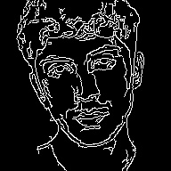
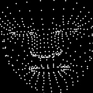

# AvatarPose

This project uses Machine Learning + zero-knowledge proofs to create NFTs for users. It uses pose estimation to detect human poses in the uploaded video. These poses can then be used to animate an SVG avatar.

This approach to NFT generation aims to create NFTs from “lived experiences.” We choose to call these experiential NFTs.

## How it Works (Technical)

1. We use [ezkl](https://github.com/zkonduit/ezkl) to run our [face landmark detection model](https://huggingface.co/unity/sentis-face-landmarks). Ezkl produces a `proof.json` file that contains the detected facial features and a zk proof.

```sh
# creates settings.json with logrows 20
ezkl gen-settings -K 20

# genearates compiled model
ezkl compile-circuit

# generates witness
ezkl gen-witness 

# generates vk and pk
ezkl setup

# generates proof.json
ezkl prove
```

2. We send this proof + input data to the Cartesi machine. If verified, we can then mint an NFT for the user with the poses.

```sh
ezkl create-evm-verifier
```

## How does the NFT look like?

1. First, we extract frames (images) from the video (<5s). 


2. We then apply edge detection to them. Reason: we don't any of the chromance or metadata. Our ML model is only interested in the layout of a human-like object. Additionally, this step effectively reduces images size in **number format** - black background mean 0 color, hence significant size reduction (~3) in RGB array size. 



3. We then convert the image (`image2json.py`) to numerical data for our `input.json`. This data is the input for our compiled model.

4. After compiling the model, generating witness, setup ceremony and proving, we get a `proof.json` that contains that contains the detected facial landmarks in `outputs` field. We extract this data and save it to later mint our NFT. 

Here's an image showing the detected landmarks from the `proof.json` in this directory.



5. The app then send the proof + input data to the Cooprocessor for verification. The Cartesi machine has the `Halo2Verifier` Solidity contract. After verification, we can mint a NFT.

You may be wondering why the contract is not deployed on the blockchain:

- It's too big. It's about 4.7 MB. On Ethereum, max contract deployment size is 24kB.
- [Cost](https://risczero.com/blog/on-chain-verification). 
- For purposes of the hackathon, we decided to go with this approach. But ideally, we're supposed to use a Rust/Python library

Another reason why we're verifying on Cartesi and not a L1 is proof size. We're dealing with proofs of about ~1MB. 

6. The NFT is a **gif/video** animation that uses the detected poses. The animation is created by moving an SVG image (avatar) using the poses. Here's a look of what this means.